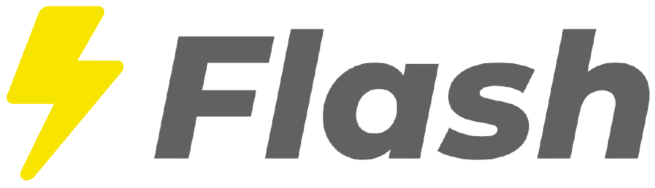
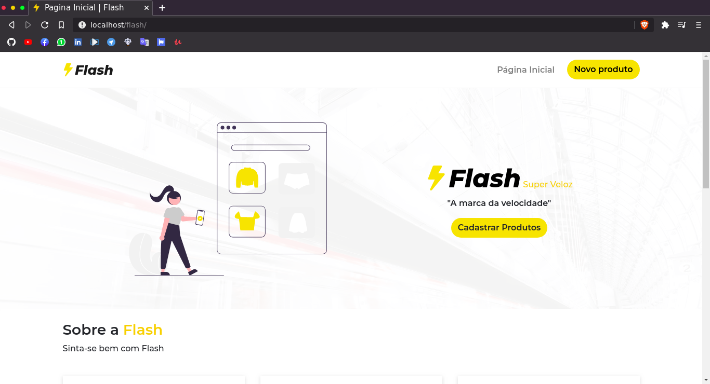
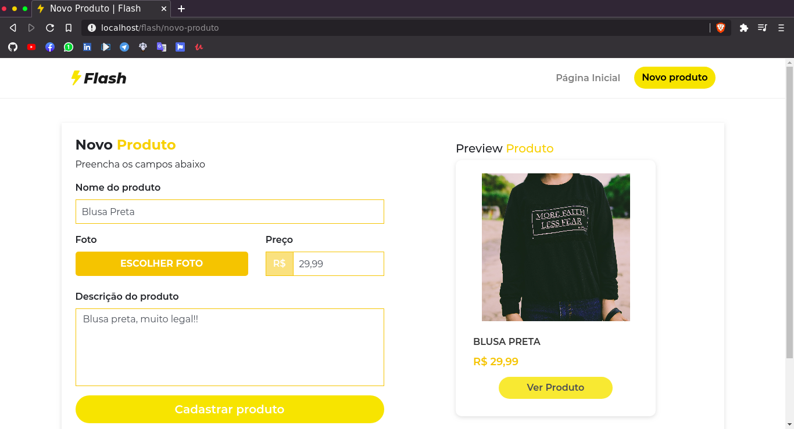
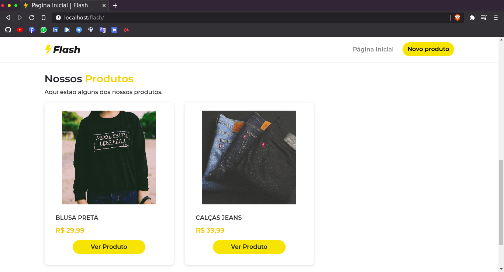
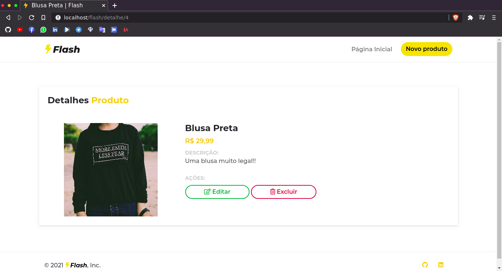

<p align="center">
  <a href="https://unform.dev">
    
  </a>
</p>

<p align="center">Flash desenvolvido em PHP 🐘 puro na estrutura MVC</p>
<p align="center">

<a href="https://github.com/kevind3v">

</a>


<a href="https://github.com/kevind3v/blog/commits/main">
    
  </a>
</p>

### 💻 Sobre o projeto

🐘 Flash - é um projeto desenvolvido em PHP (MVC), para cadastro de roupas.

### 🎨 Layout

Alguns prints do projeto:






### 🎲 Iniciar Projeto

```bash
# Instalar dependências composer
$ composer install

# Instalar as dependências package.json
$ yarn install
```

### 🛠 Tecnologias

As seguintes ferramentas foram usadas na construção do projeto:

- [PHP](https://www.php.net/)
- [Bootstrap](https://getbootstrap.com/docs/4.0/getting-started/introduction/)
- [Jquery](https://jquery.com/)
- [Node.js](https://nodejs.org/en/)

### ⭐️ Autor

<p align="center">
<a href="https://github.com/kevind3v/">
 
</a>
 <br />
 <b>Kevin Siqueira 🐘</b>
</p>

<p align="center">

<a href="mailto:kevinsiqueira.dev@gmail.com" alt="E-mail" target="_blank">
    
</a>

<a href="https://www.linkedin.com/in/kevinssiqueira/" alt="LinkedIn" target="_blank">
    
</a>

<a href="https://www.instagram.com/kevind3v/" alt="Instagram" target="_blank">
    
</a>

<a href="https://kevinsiqueira.vercel.app" alt="Instagram" target="_blank">
    
</a>

</p>
